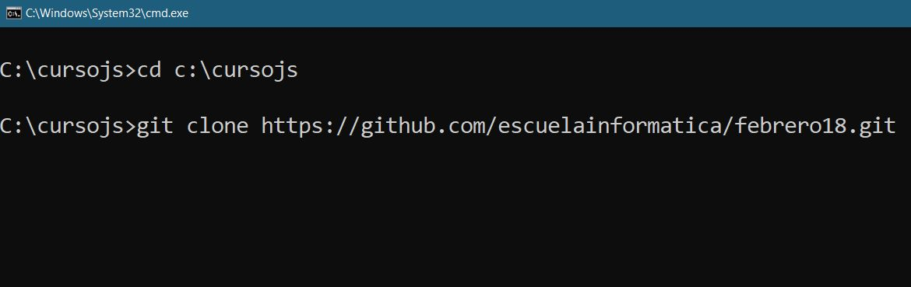
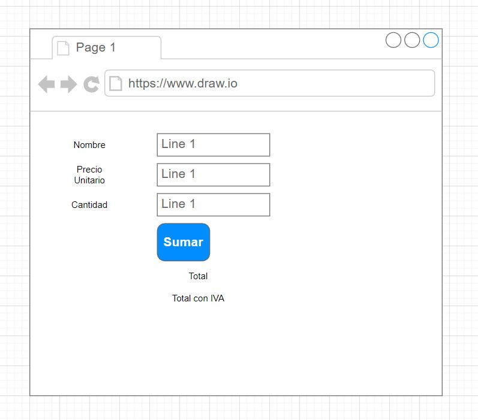

# febrero18

Git Clone

1. Creando clase de modelo. ✅ <-- iniciar

[x] Num1, Num2 (campos)   

2. Crear clases de servicio.

[x] ok   

3. Crear las vistas (html).

[x] ok

4. Unir todo.

[imagenes/imagen1.jpg](imagenes/imagen1.jpg)

## Ejercicio 1

1) Modifica el modelo para que tenga 4 campos en vez de 2 (num3 y num4).
2) Agrega las funciones (clase servicio) multiplicar y dividir.
3) Modificar la vista para que tenga esos 4 campos.

## Ejercicio 2

1) Necesitamos crear el siguiente formulario.

Un formulario donde se ingresa:
* Nombre del Producto
* Precio Unitario
* Cantidad

Y necesitamos que se calcule el precio final y ademas que se muestre el precio 
con iva.

Cree lo siguiente
* Modelo
* Servicio (3 funciones, calculo precio, calculo con iva y crear)
* Vista.

   

